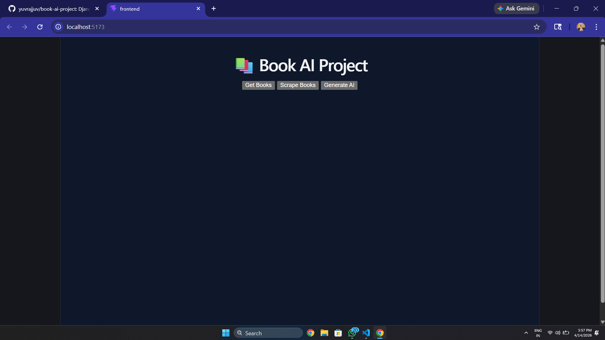
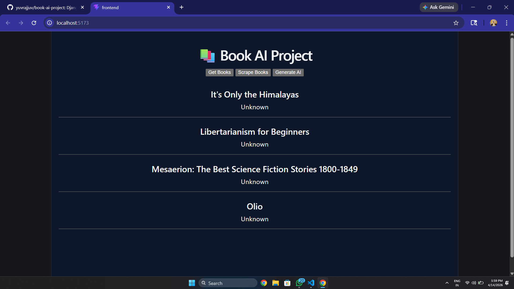
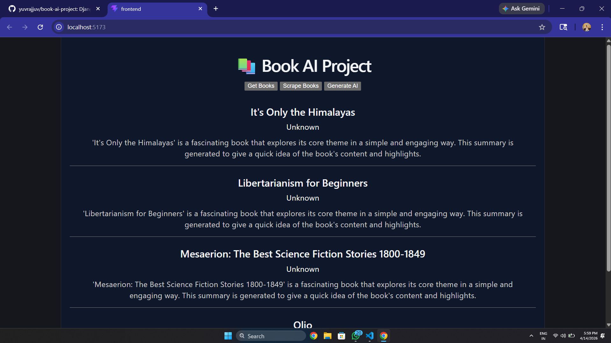

🚀 Book AI Project

An interactive Full-Stack Web Application that allows users to explore books, scrape data, and generate AI-powered summaries 📚✨

---

🌟 Features

✨ Get Books
Fetch and display a list of books from the backend

🕸️ Scrape Books
Scrape real-time book data using Python

🤖 Generate AI Summary
Automatically generate summaries for each book
(Fallback logic implemented for free usage 💡)

🎨 Modern UI
Clean and responsive frontend built with React

---

🛠️ Tech Stack

🔹 Frontend: React (Vite) ⚡
🔹 Backend: Django + Django REST Framework 🐍
🔹 Scraping: BeautifulSoup 🌐
🔹 API Handling: REST APIs 🔗

---

📂 Project Structure

book-ai-project/
│
├── backend/
├── frontend/
├── scraper/
├── README.md
└── requirements.txt

---

⚙️ How to Run Locally

🔹 Backend Setup

cd backend
python -m venv venv
venv\Scripts\activate
pip install -r requirements.txt
python manage.py runserver

---

🔹 Frontend Setup

cd frontend
npm install
npm run dev

---

🔐 Environment Variables

OPENAI_API_KEY=your_api_key_here

⚠️ Do NOT upload ".env" file on GitHub

---

👨‍💻 Author

Yuvraj 🚀

---

⭐ If you like this project, give it a star!

## 📸 Screenshots

### 🏠 Home Page

---

### 📚 Get Books

---

### 🤖 Generate AI Summary

